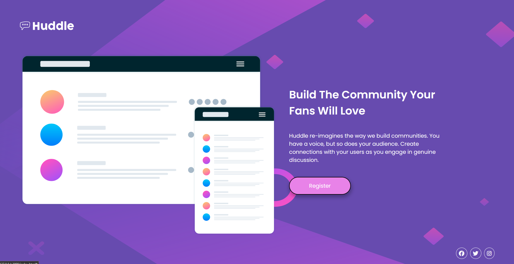

# Front-End Mentor Challenge

# Huddle Landing Page

Esse challenge do Front-End Mentor é voltado para o treinamento de Tecnologias como _HTML_ e _CSS_, utilizando Display Flex e o conceito de Mobile First, utilizando Media Query.

Para visualizar a Lading Page, basta clicar <a href="https://thejrodrigues.github.io/Huddle-Landing-Page/" target="_blank" alt="Link do Site">Aqui</a>

Abaixo consta algumas imagens da página, sendo elas da estilização para Mobile e para Desktop.

# Mobile

  
  

# Desktop

